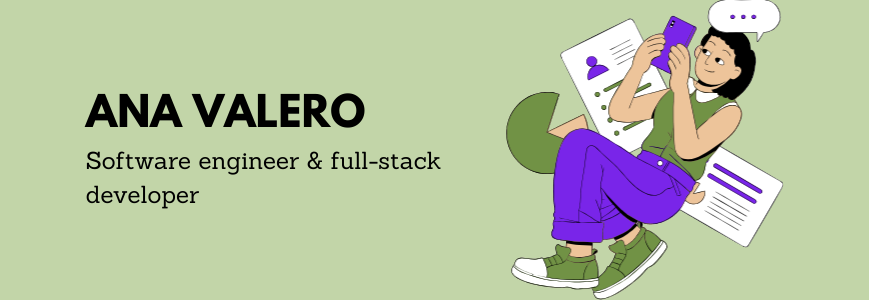

<h1>Hi, I'm Ana 👋🏽👩‍💻</h1>

###

I'm a **software engineer** passionate about making programming more accessible, creating meaningful projects, and building community.

Currently, I'm working on **data analysis projects** with a growing focus on **bioinformatics**, where I’m combining my technical background with a strong interest in health and life sciences. My goal is to pursue a **PhD** in this field to deepen my research and contribute to the intersection of technology and biology.

Previously, I’ve worked as a **project manager** for a full-stack application, leading both backend and frontend efforts.

Some technologies I enjoy working with include **Java**, **Spring Boot**, **React** (JavaScript and TypeScript), **Python**, and **SQL**.

---

- 🔬 Focused on data-driven projects in **bioinformatics**
- 💬 &nbsp;Ask me about anything related to Javascript/React/Python or Java/Spring
- 👨‍💻 &nbsp;Read about my university notes at [wuolah](https://wuolah.com/profile/anavalero5?referral=anao52) or [studocu](https://www.studocu.com/es/user/31431423?origin=user-menu)
- 📚 &nbsp;Read about my learing notes at [learningNotes](https://github.com/anavagi/LearningNotes) project
- ⚡ &nbsp;Fun fact: I :heart: reading and posting on my blog [Eldiariosablelotodo](https://eldiariosablelotodo.blogspot.com/)

 

#### Programming Languages
 
 
 
 

####
###

**Languages and skills**

 
    
   
      
 
   

  
  
  
  
  
  
  
  

  
  
  
  
  
  
  
  
  
  
  
  
  
  
  
  
  
  
  
  
  
  
  
  
  
  
  
  
  
  
  
  
  
  
  
  
  
  

###

🔗 &nbsp;**Connect with me**

  
  

